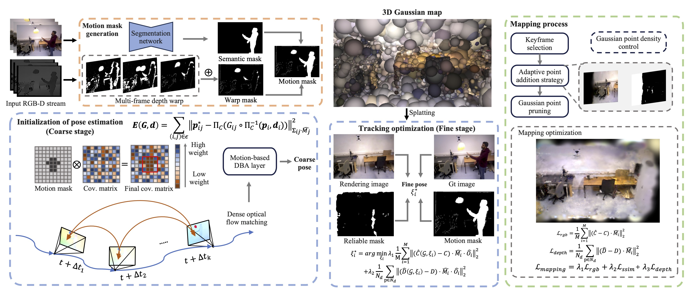

# DG-SLAM: Robust Dynamic Gaussian Splatting SLAM with Hybrid Pose Optimization
### [[Paper]](https://arxiv.org/abs/2411.08373) 

> [**DG-SLAM: Robust Dynamic Gaussian Splatting SLAM with Hybrid Pose Optimization**](https://arxiv.org/abs/2411.08373),            
> Yueming Xu*, Haochen Jiang*, Zhongyang Xiao, Jianfeng Feng, Li Zhang  
> **NeurIPS 2024**

**Official implementation of "DG-SLAM: Robust Dynamic Gaussian Splatting SLAM with Hybrid Pose Optimization".** 

## 🛠️ Pipeline
<div align="center">
  
</div><br/>

## ⚙️ Installation

Please follow the instructions below to install the repo and dependencies.

```bash
git clone https://github.com/fudan-zvg/DG-SLAM.git
cd DG-SLAM
```

### Install the environment

```bash
# Create conda environment
conda create -f environment.ymal
conda activate dgslam
```

If the front-end fail to execute successfully, please consult the official repository and accompanying guidance [DROID-SLAM](https://github.com/princeton-vl/DROID-SLAM.git). The pretrained weights for DROID-SLAM can also be downloaded from this repository. The `.path` file should be placed in the `./checkpoints` folder.


## 📂 Download Dataset & Data preprocessing

#### TUM RGB-D Dataset
Download 6 dynamic scene sequences of TUM RGB-D dataset into `./data/TUM` folder.

```bash
bash scripts/download_tum.sh 
```

#### BONN Dynamic RGB-D Dataset
Download 6 dynamic scene sequences of BONN RGB-D dataset into `./data/BONN` folder.

```bash
bash scripts/download_bonn.sh 
```

#### ScanNet Dataset
Please send an official email to request permission for dataset access.

#### Data preprocessing
- **Semantic Segmentation Mask**: Firstly, you should generate semantic motion mask with [OneFormer](https://github.com/SHI-Labs/OneFormer). For guidance on the environmental setup and execution process for this approach, please refer to the instructions provided on the official GitHub page. Secondly, move these generate mask images to the root path of dataset and create the folder named `./seg_mask`  


## 🔄 Run
You can run DG-SLAM using the code below:

```
python run_tum.py
```

## 📜 BibTeX
If you find our code or paper useful for your research, please consider citing:
```bibtex
@inproceedings{xu2024dgslam,
title={{DG}-{SLAM}: Robust Dynamic Gaussian Splatting {SLAM} with Hybrid Pose Optimization},
author={Yueming Xu and Haochen Jiang and Zhongyang Xiao and Jianfeng Feng and Li Zhang},
booktitle={The Thirty-eighth Annual Conference on Neural Information Processing Systems},
year={2024},
url={https://openreview.net/forum?id=tGozvLTDY3}
}
```

## Acknowledgement
Thanks to previous open-sourced repo: [3D-GS](https://github.com/graphdeco-inria/gaussian-splatting), [Point-SLAM](https://github.com/eriksandstroem/Point-SLAM), [DROID-SLAM](https://github.com/princeton-vl/DROID-SLAM), [SplaTAM](https://github.com/spla-tam/SplaTAM).

## Contact
Contact [Yueming Xu](xuyueming21@m.fudan.edu.cn) and [Haochen Jiang](jianghc1995@gmail.com) for questions, comments and reporting bugs.
